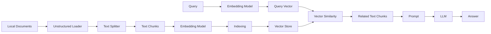

```mermaid
graph LR
LD[Local Documents] --> UL[Unstructured Loader]
UL --> TS[Text Splitter]
TS --> TC[Text Chunks]
TC --> EM1[Embedding Model]
EM1 --> IX[Indexing]
IX --> VS[Vector Store]

    Q[Query] --> EM2[Embedding Model]
    EM2 --> QV[Query Vector]
    QV --> VS2[Vector Similarity]
VS --> VS2
VS2 --> RT[Related Text Chunks]
RT --> P[Prompt]
P --> LLM[LLM]
LLM --> A[Answer]
```
