# Retrieval-Augmented Generation (RAG) Knowledge Sharing

## 1. Why Do We Need RAG?

### 1.1 Limitations of Traditional LLMs

- Hallucination issues
- High cost for fine-tuning
- Privacy concerns with sensitive data

## 2. Use Cases for RAG

### 2.1 Enterprise Applications

- Internal knowledge base chatbots
- Legal document analysis
- Medical research assistance

## 3. RAG Architecture and Principles

### 3.1 Basic Components

#### Overview Diagram

```mermaid
flowchart TD
    %% Document Processing
    subgraph subGraph0["📄 Document Processing"]
        B["📥 Unstructured Loader"]
        C["✂ Text Processing"]
    end

    %% Vector Storage
    subgraph subGraph1["📂 Vector Storage"]
        E["🔢 Embedding Model"]
        F["📊 Indexing"]
        G["🗃️ Vector Store"]
    end

    %% Query & Retrieval
    subgraph subGraph2["🔍 Query & Retrieval"]
        H["🔍 Query"]
        I["🔢 Embedding Model"]
        J["🧩 Query Vector"]
        K["🔎 Vector Similarity"]
        L["📑 Related Text Chunks"]
    end

    %% Response Generation
    subgraph subGraph3["🤖 Response Generation"]
        M["📝 Prompt"]
        N["🤖 LLM"]
        O["📩 Answer"]
    end

    %% Flow connections
    A["📂 Local Documents"] -->|Load Documents| B
    B -->|Split & Chunk Text| C
    C -->|Tokenize Text| D["🔠 Tokenization"]
    D -->|Convert to Vector| E
    E -->|Indexing| F
    F -->|Store in DB| G
    H -->|Convert to Vector| I
    I -->|Generate Query Vector| J
    J -->|Vector Similarity Search| K
    K -->|Retrieve Related Chunks| L
    L -->|Prepare Prompt| M
    M -->|Generate Response| N
    N --> O
    G --> K
```

