- [Retrieval-Augmented Generation (RAG) Knowledge Sharing](#retrieval-augmented-generation-rag-knowledge-sharing)
  - [1. Why Do We Need RAG?](#1-why-do-we-need-rag)
    - [1.1 Limitations of Traditional LLMs](#11-limitations-of-traditional-llms)
  - [2. Use Cases for RAG](#2-use-cases-for-rag)
    - [2.1 Enterprise Applications](#21-enterprise-applications)
  - [3. RAG Architecture and Principles](#3-rag-architecture-and-principles)
    - [3.1 Basic Components](#31-basic-components)
      - [Overview Diagram](#overview-diagram)
      - [Core Concepts](#core-concepts)
      - [Document Processing Pipeline](#document-processing-pipeline)
      - [Query Processing Pipeline](#query-processing-pipeline)
      - [Response Generation](#response-generation)
  - [4. DIFY DEMO for RAG](#4-dify-demo-for-rag)
    - [4.1 Main Features](#41-main-features)
    - [4.2 RAG Implementation Steps](#42-rag-implementation-steps)
    - [4.3 Verification](#43-verification)

# Retrieval-Augmented Generation (RAG) Knowledge Sharing

## 1. Why Do We Need RAG?

### 1.1 Limitations of Traditional LLMs

- Hallucination issues
- High cost for fine-tuning
- Privacy concerns with sensitive data

## 2. Use Cases for RAG

### 2.1 Enterprise Applications

- Internal knowledge base chatbots
- Legal document analysis
- Medical research assistance

## 3. RAG Architecture and Principles

### 3.1 Basic Components

#### Overview Diagram

```mermaid
flowchart TD
    %% Document Processing
    subgraph subGraph0["📄 Document Processing"]
        B["📥 Unstructured Loader"]
        C["✂ Text Processing"]
    end

    %% Vector Storage
    subgraph subGraph1["📂 Vector Storage"]
        E["🔢 Embedding Model"]
        F["📊 Indexing"]
        G["🗃️ Vector Store"]
    end

    %% Query & Retrieval
    subgraph subGraph2["🔍 Query & Retrieval"]
        H["🔍 Query"]
        I["🔢 Embedding Model"]
        J["🧩 Query Vector"]
        K["🔎 Vector Similarity"]
        L["📑 Related Text Chunks"]
    end

    %% Response Generation
    subgraph subGraph3["🤖 Response Generation"]
        M["📝 Prompt"]
        N["🤖 LLM"]
        O["📩 Answer"]
    end

    %% Flow connections
    A["📂 Local Documents"] -->|Load Documents| B
    B -->|Split & Chunk Text| C
    C -->|Tokenize Text| D["🔠 Tokenization"]
    D -->|Convert to Vector| E
    E -->|Indexing| F
    F -->|Store in DB| G
    H -->|Convert to Vector| I
    I -->|Generate Query Vector| J
    J -->|Vector Similarity Search| K
    K -->|Retrieve Related Chunks| L
    L -->|Prepare Prompt| M
    M -->|Generate Response| N
    N --> O
    G --> K
```

#### Core Concepts

1. **Tokenization**

   - Breaks text into tokens
   - Helps handle out-of-vocabulary words

2. **Embedding Model**

   - Converts text into numerical vectors

3. **Vector Store**
   - Database for storing and searching vectors

#### Document Processing Pipeline

1. **Local Documents**: Source materials, e.g: pdf, word, txt
2. **Unstructured Loader**: Converts formats to text
3. **Text Splitter**: Breaks into chunks
4. **Text Chunks**: Manageable segments
5. **Tokenization**: Breaks text into tokens
6. **Embedding Model**: Converts to vectors
7. **Indexing**: Organizes vectors
8. **Vector Store**: Stores vectors

#### Query Processing Pipeline

1. **Query**: User input
2. **Embedding Model**: Converts query to vector
3. **Query Vector**: Vector representation
4. **Vector Similarity**: Compares vectors
5. **Related Text Chunks**: Retrieved context

#### Response Generation

1. **Prompt**: Combines query and context
2. **LLM**: Generates response
3. **Answer**: Final output

## 4. DIFY DEMO for RAG

DIFY is an open-source LLM application development platform that simplifies the creation of AI applications.

### 4.1 Main Features

- No-code/Low-code development interface
- Built-in RAG pipeline support
- Various LLM provider support
- Visual knowledge base management

### 4.2 RAG Implementation Steps

1. **Environment Setup**

   - Start and setup DIFY in local environment

2. **Knowledge Base Creation**

3. **Document Processing**

   - Upload documents
   - Configure chunk settings
   - Select index mode
     

4. **Select the Embedding Model**

5. **Retrieval Settings**

   - Vector search: Finds similar content by comparing document vectors in high-dimensional space
   - Full-text search: Traditional keyword-based search across document content

6. **Chunk Preview**
   

7. **Knowledge Created**
   

### 4.3 Verification

1. **Retrieval Testing**
   

2. **Chat Testing**
   - **Without RAG Example**
     
   - **With RAG Example**
     
